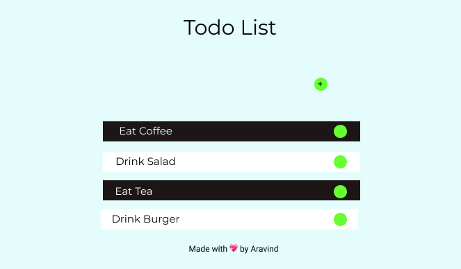

# **Todo Or Doto**
Its a ReactJS app which allows you to *create* your todo
works and *remove* it too..

## What used here
1. This App was Designed in figma which is basic UI of App

2. Here I Used  `styled-components` for creating
Reusable *UI*s with `css`

### App is Deployed

This App is build using `react-scripts build` and that build bundle is deployed in **Netlify** and  [Click Here](https://todo-or-doto.netlify.app/) to Go to App page and link is `https://todo-or-doto.netlify.app/`

### Run the app in your Server
1. Clone this Repository 
2. And in bash in current folder which u cloned
3. Run `yarn install` or `npm install`
4. After that, run `npm start` or `yarn start` to start Development Server
5. For Build Version run `npm run build` or `yarn build`
6. Host the `build` folder wherever u want to..

Hurray You Just Deployed an App..

## Issues
If you found any issue feel free to post in `issue` 

**Thanks For Reading💖**